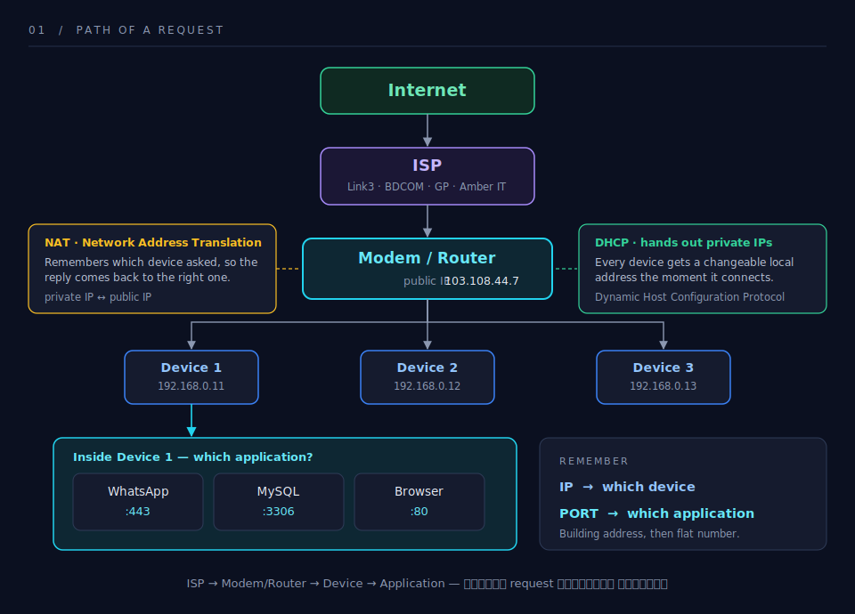
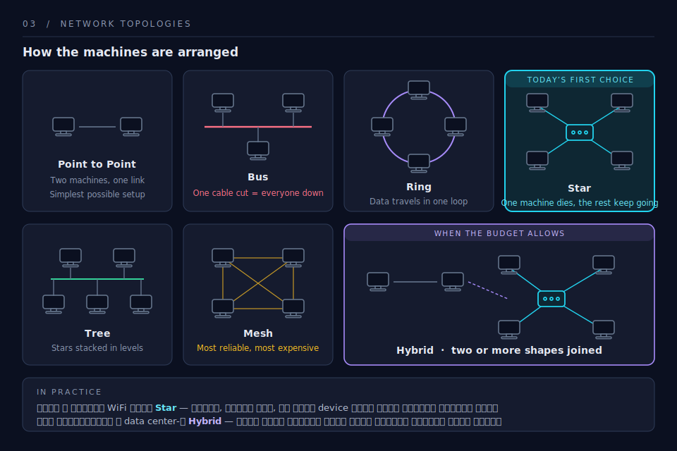
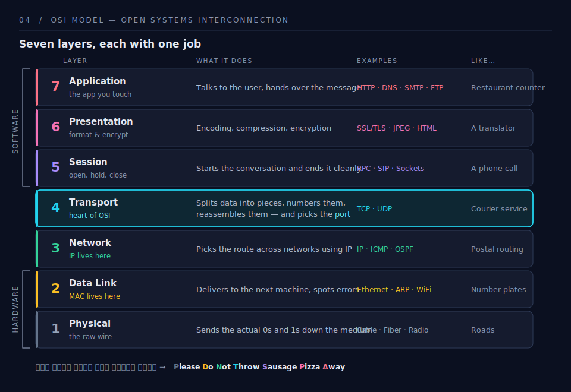
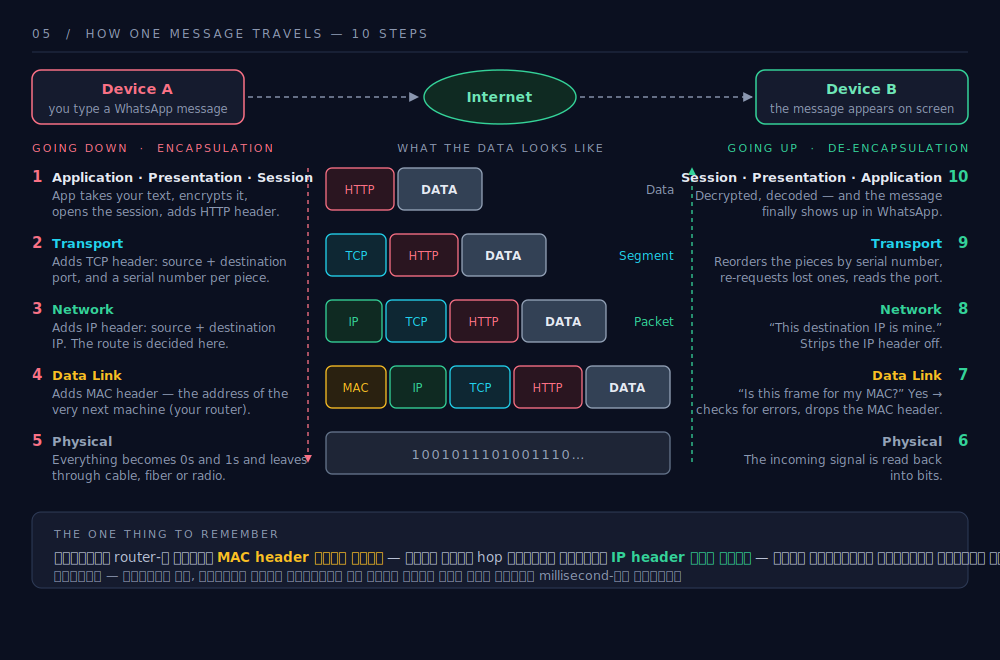
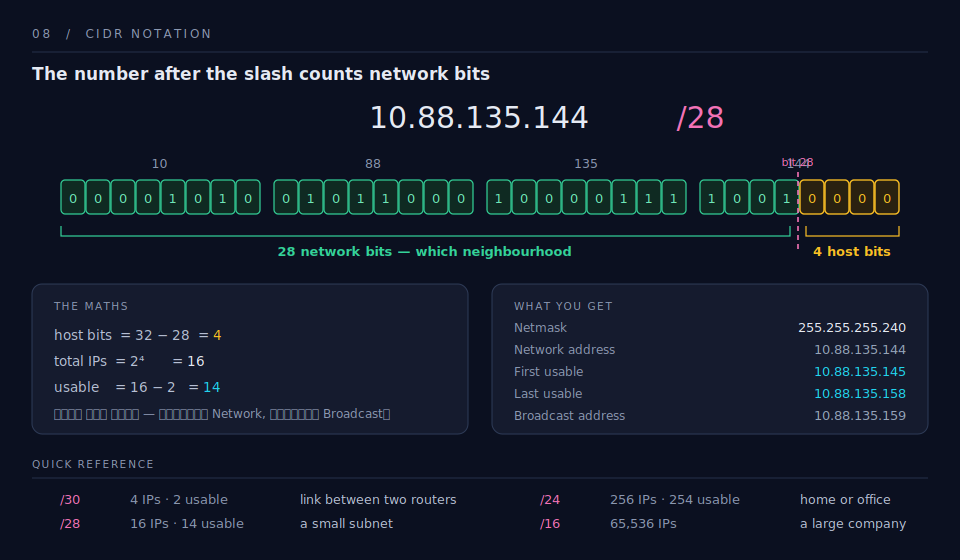

# 🖥️ Computer Networking — Class 1

> ক্লাসের নোট, সহজ ভাষায় সাজানো। টেকনিক্যাল শব্দগুলো ইংরেজিতেই রাখা হয়েছে।

---

## 🏤 নেটওয়ার্কিং আসলে কী? (Post Office উপমা)

Internet অনেকটা অফলাইনের **post office**-এর মতো করেই কাজ করে।

- Post office থেকে কোনো জিনিস পাঠাতে গেলে যেমন **নিজের নাম আর ঠিকানা** দিতে হয়, ঠিক তেমনি প্রতিটা computer-এরও একটা নিজস্ব **address** থাকে।
- Post office যেমন **tracking** করে — জিনিসটা এখন কোথায় আছে, কখন delivery হবে — নেটওয়ার্কিংয়েও ঠিক তেমন একটা ব্যবস্থা আছে, যাকে বলে **TCP handshake** (দুই device আগে "হ্যান্ডশেক" করে নিশ্চিত হয়ে তারপর data পাঠায়)।

### 📦 Data Packet (খামের উপমা)

আগের যুগে ধরো একটা **১০০০ পৃষ্ঠার বই** পাঠাতে চাইলে সেটা একসাথে পাঠানো যেত না। তখন বইটাকে ভাগ ভাগ করে **১০০০টা খামে (envelope)** ভরে পাঠাতে হতো।

- সিরিয়াল ঠিক রাখার জন্য প্রতিটা খামে **1, 2, 3 … 1000** এভাবে নাম্বার লিখে দেওয়া হতো, যাতে ওপাশে গিয়ে ঠিক ক্রমে আবার জোড়া লাগানো যায়।

ঠিক একইভাবে YouTube video হোক বা যেকোনো data — সেটা ছোট ছোট টুকরো হয়ে আসে। এই টুকরোগুলোকেই বলে **data packet**। কয়েক **millisecond**-এর মধ্যেই এই packet-গুলো আবার একসাথে **assemble** হয়ে আমাদের সামনে চলে আসে।

👉 এই পুরো ব্যাপারটাকেই বলে **Computer Networking**।

---

## 💻 Computer কী?

একাধিক computer যখন একে অপরের সাথে **communicate** করতে পারে, সেটাই হলো **computer networking**।

> ⚠️ **মনে রাখবে:** ক্লাসে অনেক সময় বলা হয় "COMPUTER = Common Operating Machine Purposely Used for Technological and Educational Research"। এটা মূলত একটা মজার **backronym** (পরে বানানো পূর্ণরূপ) — আসল ইতিহাস নয়। "Computer" শব্দটা এসেছে ইংরেজি **"compute"** (হিসাব করা) থেকে। ক্লাসে জিজ্ঞেস করলে বলতে পারো, তবে জেনে রেখো এটা প্রকৃত acronym নয়।

---

## 🌐 Internet কী?

**Internet** হলো পৃথিবীজুড়ে ছড়িয়ে থাকা অসংখ্য **computer network-এর সমষ্টি** (collection of computer networks around the world)।

---

## 📍 IP Address

প্রতিটা smart device — যেমন PC, laptop, mobile, smart fan, smart AC — সবগুলোরই একটা করে **IP address** থাকে। এই address দিয়েই device-টাকে চেনা যায় এবং তার কাছে data পাঠানো যায়।

---

## 📜 Protocol কী?

**Protocol** হলো কিছু **নিয়ম বা rules-এর সেট**, যেগুলো ঠিক করে দেয় — data কীভাবে এক device থেকে আরেক device-এ, এক network থেকে আরেক network-এ পাঠানো হবে। এটা নিশ্চিত করে যে data **সঠিক address-এ, সঠিকভাবে** পৌঁছেছে।

> ⚠️ **ছোট্ট সংশোধন:** protocol নিজে "addressing system" নয়। *Addressing*-এর কাজটা করে **IP (Internet Protocol)**। Protocol হলো মূলত **যোগাযোগের নিয়মকানুন**, আর সেই নিয়মের ভেতরেই ঠিকানা ঠিক রাখার ব্যাপারটা আসে।

### গুরুত্বপূর্ণ কিছু Protocol

| Protocol | পূর্ণরূপ | কী কাজে লাগে |
|---|---|---|
| **TCP/IP** | Transmission Control Protocol / Internet Protocol | Internet-এ data কীভাবে transmit হবে তার মূল নিয়ন্ত্রক (core suite of protocols) |
| **UDP** | User Datagram Protocol | দ্রুতগতির data পাঠানোর জন্য (video conferencing ইত্যাদি)। খুব **speedy**, তবে মাঝেমধ্যে কিছু data **loss** হতে পারে |
| **HTTP** | HyperText Transfer Protocol | Web communication — browser আর web server-এর মধ্যে যোগাযোগ |
| **FTP** | File Transfer Protocol | এক জায়গা থেকে আরেক জায়গায় **file transfer** করা |
| **SMTP** | Simple Mail Transfer Protocol | **email** পাঠানোর জন্য |
| **DNS** | Domain Name System | Domain name (যেমন `google.com`) কে IP address-এ অনুবাদ করে দেয় |

> 💡 **DNS একটু সহজ করে:** আমরা মনে রাখি নাম (`youtube.com`), কিন্তু computer বোঝে সংখ্যা (IP address)। DNS হলো সেই "ফোনবুক", যে নামটা দেখে ঠিক IP address বের করে দেয়।
>
> 📝 অনেক জায়গায় DNS-কে "Domain Name **Service**"-ও বলা হয়, তবে standard নাম হলো "Domain Name **System**"।

---

## 🔍 নিজের PC-র IP Address জানার উপায়

Terminal-এ নিচের command চালালেই নিজের public IP চলে আসবে:

```bash
curl ifconfig.me -s
```

> ⚠️ **টাইপো ঠিক করা হলো:** command-টা `iconfig.me` নয়, হবে **`ifconfig.me`** (মাঝে একটা **`f`** আছে)। `-s` মানে "silent" — অতিরিক্ত progress লেখা লুকিয়ে রাখে।

---

## 🔢 IP-এর প্রকারভেদ

### ১. Version অনুযায়ী

- **IPv4** — পুরনো ও সবচেয়ে প্রচলিত। যেমনঃ `192.168.0.1`
- **IPv6** — নতুন সংস্করণ, অনেক বেশি address ধারণ করতে পারে। যেমনঃ `2001:0db8:85a3::8a2e:0370:7334`

### ২. স্থায়িত্ব অনুযায়ী

- **Static IP** — নির্দিষ্ট, বদলায় না। (server-এ বেশি ব্যবহার হয়)
- **Dynamic IP** — সময়ের সাথে বদলাতে থাকে। সাধারণত ISP প্রতিবার connect হলে নতুন করে দেয়।

---

## 🚪 Port

শুধু IP address জানলেই হয় না — একটা device-এর ভেতরে তো অনেকগুলো application একসাথে চলে (browser, email, game ইত্যাদি)।

- **IP address** ঠিক করে দেয় → **কোন device**-এ data যাবে।
- **Port** ঠিক করে দেয় → সেই device-এর ভেতরে **কোন application**-এ data যাবে।

এভাবেই data একেবারে **নির্দিষ্ট device-এর নির্দিষ্ট application** পর্যন্ত সঠিকভাবে পৌঁছায়।

> 💡 কিছু পরিচিত port নাম্বার (bonus):
> `HTTP → 80`, `HTTPS → 443`, `FTP → 21`, `SMTP → 25`, `DNS → 53`

---

## ✅ এক নজরে সারসংক্ষেপ

1. **Networking** = post office-এর মতো, address দিয়ে data এক জায়গা থেকে আরেক জায়গায় পাঠানো।
2. **Data packet** = বড় data ভাগ হয়ে numbered টুকরো হিসেবে যায়, ওপাশে গিয়ে জোড়া লাগে।
3. **Computer networking** = একাধিক computer-এর নিজেদের মধ্যে যোগাযোগ।
4. **Internet** = পৃথিবীজুড়ে সব network-এর সমষ্টি।
5. **IP address** = প্রতিটা device-এর ঠিকানা।
6. **Protocol** = যোগাযোগের নিয়মকানুন (TCP/IP, UDP, HTTP, FTP, SMTP, DNS)।
7. **Port** = device-এর ভেতরে নির্দিষ্ট application-এর ঠিকানা।

---

*📚 Computer Networking — Class 1 শেষ*

---
---

# 🌐 Computer Networking — Class 2

> ISP থেকে শুরু করে OSI Model, MAC Address আর Subnet পর্যন্ত — ক্লাসের ছবিসহ সাজানো নোট।

---

## 📑 সূচিপত্র

1. [Internet কীভাবে আমার ঘরে আসে?](#-১-internet-কীভাবে-আমার-ঘরে-আসে)
2. [Public IP vs Private IP](#-২-public-ip-vs-private-ip)
3. [DHCP — কে কোন IP পাবে?](#-৩-dhcp--কে-কোন-ip-পাবে)
4. [NAT — কে request করেছিল?](#-৪-nat--কে-request-করেছিল)
5. [PORT — কোন application?](#-৫-port--কোন-application)
6. [Network Topology](#-৬-network-topology)
7. [MAC Address vs IP Address](#-৭-mac-address-vs-ip-address)
8. [OSI Model](#-৮-osi-model--open-systems-interconnection)
9. [Data-র পুরো যাত্রা (Step by Step)](#-৯-data-র-পুরো-যাত্রা--step-by-step)
10. [Subnet ও Subnet Mask](#-১০-subnet-ও-subnet-mask)
11. [CIDR Notation](#-১১-cidr-notation)
12. [বাস্তব উদাহরণ — AWS VPC](#-১২-বাস্তব-উদাহরণ--aws-vpc)

---

## 🏠 ১. Internet কীভাবে আমার ঘরে আসে?



পুরো যাত্রাটা এভাবে:

```
Internet  ⇄  ISP  ⇄  Modem/Router  ⇄  D1, D2, D3 (তোমার device)
```

- **ISP (Internet Service Provider)** — যারা আমাদের কাছে internet বিক্রি করে। যেমনঃ **Link3, BDCOM, BRACNet, Amber IT**; আর mobile data-র ক্ষেত্রে **GP, Robi, Banglalink**।
- ISP-রা সরাসরি, অথবা এলাকার **local provider**-এর মাধ্যমে, তোমার বাসার **modem/router** পর্যন্ত connection পৌঁছে দেয়।
- ISP তোমার modem/router-কে একটা **public (global) IP address** দেয়। এই IP-টা **পুরো দুনিয়ার কাছে পরিচিত** — internet তোমাকে এই ঠিকানাতেই চেনে।
- ওই modem-এর সাথে যত device connect থাকে (mobile, laptop, smart TV), internet-এ যাওয়ার সময় **সবাই ওই একটাই public IP share করে**।

> 💡 **Modem আর Router কি এক?**
> আসলে দুটো আলাদা কাজ — **Modem** ISP-র signal-কে digital data-য় রূপান্তর করে, আর **Router** সেই internet-টা ঘরের অনেকগুলো device-এর মধ্যে ভাগ করে দেয়। বাসায় যে বক্সটা থাকে, তাতে সাধারণত **দুটো কাজই একসাথে** থাকে — তাই আমরা "modem/router" বলি।

---

## 🔢 ২. Public IP vs Private IP

| | **Public IP** | **Private IP (Local IP)** |
|---|---|---|
| **কে দেয়?** | ISP → তোমার router-কে | তোমার router → ঘরের device-গুলোকে |
| **কে চেনে?** | পুরো internet | শুধু তোমার ঘরের network |
| **উদাহরণ** | `103.108.x.x` | `192.168.0.5`, `192.168.0.6` |
| **কয়টা?** | পুরো বাসার জন্য একটা | প্রতিটা device-এর আলাদা |

> 🏢 **সহজ উপমা:** Public IP হলো **পুরো বিল্ডিংয়ের ঠিকানা**, আর Private IP হলো ভেতরের **ফ্ল্যাট নাম্বার**। ডাকপিয়ন বিল্ডিং পর্যন্ত আসে, তারপর দারোয়ান (router) ঠিক ফ্ল্যাটে পৌঁছে দেয়।

> ⚠️ **একটা ছোট সংশোধন:** ক্লাসে বলা হয়েছিল modem-এর IP "নির্দিষ্ট"। বাস্তবে সাধারণ বাসাবাড়ির connection-এ ISP-ও বেশিরভাগ সময় **dynamic public IP** দেয় — router restart করলে বা কিছুদিন পর সেটা বদলে যেতে পারে। **Static public IP** সাধারণত আলাদা টাকা দিয়ে কিনতে হয় (server host করার জন্য)।

---

## 🔄 ৩. DHCP — কে কোন IP পাবে?

তোমার router প্রতিটা device-কে যে **dynamic (পরিবর্তনশীল) local IP** দেয়, সেটা দেয় **DHCP** protocol-এর মাধ্যমে।

**DHCP = Dynamic Host Configuration Protocol**


কাজটা এমন:

1. নতুন device (ধরো তোমার mobile) WiFi-তে connect হলো।
2. সে চিৎকার করে জিজ্ঞেস করে — *"আমাকে একটা IP দিবে কেউ?"*
3. Router (DHCP server) বলে — *"নাও, তুমি আজ `192.168.0.7`।"*
4. কিছুদিন পর সেই IP আবার বদলেও যেতে পারে — তাই এর নাম **dynamic**।

---

## 🎭 ৪. NAT — কে request করেছিল?

ঘরের ৩টা device (D1, D2, D3) সবাই একই public IP দিয়ে internet-এ যাচ্ছে। তাহলে উত্তর ফিরে এলে router কীভাবে বুঝবে সেটা কার?

এই কাজটা করে **NAT (Network Address Translation)**।

- বাইরে যাওয়ার সময় router private IP-কে public IP-তে বদলে দেয় এবং **খাতায় লিখে রাখে** কোন device কী চেয়েছিল।
- উত্তর ফিরে এলে খাতা দেখে **ঠিক device-এর কাছে** পাঠিয়ে দেয়।

---

## 🚪 ৫. PORT — কোন application?

Router তো বুঝল data **D1**-এর জন্য। কিন্তু D1-এর ভেতরে তো একসাথে অনেক কিছু চলছে — WhatsApp, Browser, MySQL, Game। এখন কোনটায় দিবে?

এই সমস্যার সমাধানই **PORT**।

প্রতিটা application বা service-এর জন্য একটা করে **port number** নির্দিষ্ট থাকে। এজন্যই **WhatsApp-এর message কখনো browser-এ চলে যায় না** — port নাম্বার আলাদা।

> ### 🎯 এক লাইনে মনে রাখার সূত্র
> **IP address** ঠিক করে → **কোন device**
> **PORT** ঠিক করে → **কোন application**

### 📋 পরিচিত কিছু Port

#### পরিচিত network port-গুলোর তালিকা

| Port | Service | Protocol | কাজ |
|---|---|---|---|
| **21** | FTP | TCP | File Transfer Protocol (Control) |
| **22** | SSH | TCP | Secure Shell — নিরাপদে remote login |
| **25** | SMTP | TCP | Email পাঠানো (routing) |
| **53** | DNS | UDP/TCP | Domain name → IP address অনুবাদ |
| **80** | HTTP | TCP | সাধারণ web traffic |
| **110** | POP3 | TCP | Email নামানো (retrieval) |
| **443** | HTTPS | TCP | নিরাপদ (encrypted) web traffic |
| **3306** | MySQL | TCP | Database service |
| **27017** | MongoDB | TCP | Database service |

> 💡 তাই যখন তুমি MySQL-এ data insert করো, সেই request যায় **port 3306**-এ; আর browser-এ কোনো site খুললে যায় **port 443**-এ। Device একই, কিন্তু দরজা আলাদা।

---

## 🕸️ ৬. Network Topology

**Topology** মানে হলো — একটা network-এর device-গুলো একে অপরের সাথে **কোন গঠনে/নকশায় সাজানো**।



| Topology | কীভাবে সাজানো | সুবিধা | অসুবিধা |
|---|---|---|---|
| **Point to Point** | দুটো device সরাসরি যুক্ত | সবচেয়ে সহজ, দ্রুত | মাত্র ২টা device |
| **Bus** | একটা main cable, সবাই তাতে যুক্ত | খরচ কম, বসানো সহজ | main cable কাটলে **পুরো network বন্ধ** |
| **Ring** | সবাই বৃত্তাকারে যুক্ত | সংঘর্ষ (collision) কম | একটা node নষ্ট হলে পুরো ring ভেঙে পড়তে পারে |
| **Star** ⭐ | সবাই মাঝখানের switch/hub-এ যুক্ত | একটা device নষ্ট হলে বাকিরা ঠিক থাকে, সহজে খুঁজে বের করা যায় | **মাঝের switch নষ্ট হলে সব বন্ধ** |
| **Tree** | কয়েকটা star একসাথে ধাপে ধাপে | বড় network-এ ভালো | গঠন জটিল |
| **Mesh** | প্রায় সবাই সবার সাথে যুক্ত | সবচেয়ে নির্ভরযোগ্য, একাধিক বিকল্প রাস্তা | **খুব ব্যয়বহুল**, প্রচুর cable |
| **Hybrid** | দুই বা তার বেশি topology মিলিয়ে | বাস্তব প্রয়োজন অনুযায়ী নমনীয় | খরচ ও রক্ষণাবেক্ষণ বেশি |

### 🎯 বর্তমান দুনিয়ায় কোনটা ব্যবহার হয়?

- **প্রথম পছন্দ → Star Topology।** কারণ খরচ সহনীয়, বসানো সহজ, আর কোনো একটা device নষ্ট হলে বাকি network দিব্যি চলতে থাকে। বাসাবাড়ি ও অফিসের WiFi/switch — সবই আসলে star।
- **বাজেট থাকলে → Hybrid Topology।** বড় প্রতিষ্ঠান বা data center-এ star + mesh মিলিয়ে এমনভাবে সাজানো হয় যাতে **একটা রাস্তা বন্ধ হলেও বিকল্প রাস্তা** থেকে যায়।

---

## 🏷️ ৭. MAC Address vs IP Address

Topology ছাড়াও network-এর দুনিয়ায় **দুটো জিনিস সবচেয়ে গুরুত্বপূর্ণ**:

### ১️⃣ MAC Address

- **MAC = Media Access Control**
- যখন কোনো device তৈরি (manufacture) হয়, তখনই তার **NIC card (Network Interface Card)**-এর ভেতরে একটা **unique নাম্বার সিল মেরে (embed করে) দেওয়া হয়** — এটাই MAC address।
- এই নাম্বার পৃথিবীতে **আর কোনো device-এর সাথে মেলে না** — এক device-এর নাম্বার অন্য device নিতে পারে না।
- দেখতে এমনঃ `A4:B1:C2:D3:E4:F5` (৪৮ bit, hexadecimal)
- এটা device-এর সাথে **স্থায়ীভাবে জুড়ে থাকে** — তুমি ঢাকা থেকে ফেনী গেলেও laptop-এর MAC একই থাকবে।

### ২️⃣ IP Address

- এটা **স্থায়ী নয়** — network অনুযায়ী বদলায়। বাসায় এক IP, অফিসে গেলে আরেক IP।
- এটা device-কে **network-এর ভেতরে খুঁজে পাওয়ার ঠিকানা**।

### 🆚 পার্থক্য এক নজরে

#### MAC Address বনাম IP Address

| | **MAC Address** | **IP Address** |
|---|---|---|
| কে দেয়? | Manufacturer (NIC card-এ) | Network / router (DHCP) |
| বদলায়? | না, স্থায়ী | হ্যাঁ, network বদলালে বদলায় |
| কাজের এলাকা | **Local network**-এর ভেতরে | **এক network থেকে আরেক network** |
| OSI Layer | Layer 2 (Data Link) | Layer 3 (Network) |
| উপমা | তোমার **NID/জন্মনিবন্ধন নাম্বার** | তোমার **বর্তমান বাসার ঠিকানা** |

> ⚠️ **ছোট নোট:** MAC address hardware-এ স্থায়ীভাবে লেখা থাকে ঠিকই, তবে software দিয়ে সাময়িকভাবে অন্য একটা MAC দেখানো সম্ভব — একে বলে **MAC spoofing**। মূল burned-in address কিন্তু বদলায় না।

---

## 🧱 ৮. OSI Model — Open Systems Interconnection

**OSI = Open Systems Interconnection**

দুটো computer-এর মধ্যে data আদান-প্রদানের পুরো প্রক্রিয়াটা **৭টা ধাপে (layer)** ভাগ করে বোঝানোর একটা আদর্শ মডেল। প্রতিটা layer-এর নিজস্ব দায়িত্ব আছে।



| # | Layer | কাজ | উদাহরণ / Protocol |
|---|---|---|---|
| **7** | **Application** | ব্যবহারকারীর সাথে সরাসরি যোগাযোগ | HTTP, HTTPS, DNS, SMTP, FTP, POP |
| **6** | **Presentation** | Data-র format ঠিক করা, **encryption**, compression | JPEG, MP3, HTML, SSL/TLS |
| **5** | **Session** | সংযোগ শুরু করা, চালু রাখা, শেষ করা | RPC, SIP, Named Pipes |
| **4** | **Transport** | নির্ভরযোগ্যভাবে পৌঁছানো, ভাগ করা, **port** ব্যবহার | **TCP, UDP**, SCTP |
| **3** | **Network** | **IP address** দিয়ে সঠিক রাস্তা বাছাই (routing) | IP, ICMP, OSPF, IPSec |
| **2** | **Data Link** | **MAC address** দিয়ে পাশের device-এ পৌঁছানো, error ধরা | Ethernet, ARP, VLAN, WiFi (802.11) |
| **1** | **Physical** | 0 আর 1 আকারে বাস্তবে পাঠানো | Cable, Fiber, Hub, Radio signal |

- **Layer 5, 6, 7 → Software Layer** (মূলত application-এর কাজ)
- **Layer 1, 2 → Hardware Layer** (তার, কার্ড, signal)
- **Layer 4 (Transport) → "Heart of OSI"** — এখানেই ঠিক হয় data নির্ভুলভাবে পৌঁছাবে (TCP) নাকি দ্রুত পৌঁছাবে (UDP)।

### 🧠 মনে রাখার সহজ কৌশল

নিচ থেকে উপরে (1 → 7):
> **P**lease **D**o **N**ot **T**hrow **S**ausage **P**izza **A**way
> *Physical, Data Link, Network, Transport, Session, Presentation, Application*

### 🍽️ বাস্তব জীবনের উদাহরণ দিয়ে OSI

| Layer | বাস্তব উপমা |
|---|---|
| **1. Physical** | রাস্তা বা হাইওয়ে — যার উপর দিয়ে গাড়ি চলে |
| **2. Data Link** | ট্রাফিক নিয়ম ও গাড়ির **নাম্বার প্লেট** (= MAC address) |
| **3. Network** | **ডাক ব্যবস্থা** — কোন ঠিকানায় যাবে, কোন রুটে যাবে |
| **4. Transport** | **কুরিয়ার সার্ভিস** — পার্সেল নিরাপদে ও সম্পূর্ণভাবে পৌঁছাচ্ছে কিনা তা নিশ্চিত করা |
| **5. Session** | ফোনকল — সংযোগ ধরানো, ধরে রাখা, কেটে দেওয়া |
| **6. Presentation** | **অনুবাদক** — দুই পক্ষ যাতে একই ভাষা বোঝে |
| **7. Application** | রেস্টুরেন্টের কাউন্টার — যেখানে গ্রাহক সরাসরি অর্ডার দেয় |

---

## 🚚 ৯. Data-র পুরো যাত্রা — Step by Step

ধরো, তুমি **Device A** থেকে WhatsApp-এ একটা message পাঠাচ্ছো **Device B**-কে। Data কোথা থেকে কোথায় যায়, দেখে নাও:



### ⬇️ পাঠানোর সময় (Device A) — উপর থেকে নিচে

এই প্রক্রিয়াটার নাম **Encapsulation** — প্রতিটা layer data-র গায়ে নিজের একটা **header** (ঠিকানার চিরকুট) লাগিয়ে দেয়, ঠিক যেন খামের ভেতর খাম।

| ধাপ | Layer | কী ঘটে | Data-কে তখন বলে |
|---|---|---|---|
| **১** | **7-6-5** Application, Presentation, Session | WhatsApp তোমার লেখা message নেয়। Format ঠিক হয়, **encrypt** হয়, আর Device B-র সাথে session তৈরি হয়। **HTTP header** যুক্ত হয়। | **Data** |
| **২** | **4** Transport | **TCP header** যুক্ত হয় — এতে থাকে **source port ও destination port**, আর টুকরোগুলোর **সিরিয়াল নাম্বার**। বড় data এখানেই ছোট ছোট ভাগে ভাগ হয়। | **Segment** (TCP) / **Packet** (UDP) |
| **৩** | **3** Network | **IP header** যুক্ত হয় — এতে থাকে **source IP ও destination IP**। এখানেই ঠিক হয় কোন রাস্তায় (route) যাবে। | **IP Datagram / Packet** |
| **৪** | **2** Data Link | **MAC header** যুক্ত হয় — পরের device (তোমার router)-এর **MAC address**। সাথে error ধরার জন্য trailer। | **Frame** |
| **৫** | **1** Physical | পুরো জিনিসটা **0 আর 1**-এ (`10010111...`) রূপান্তরিত হয়ে cable/fiber/radio signal হিসেবে বেরিয়ে যায়। | **Bits** |

### 🌍 মাঝপথে

Bits গুলো router → ISP → internet → গন্তব্যের ISP → গন্তব্যের router হয়ে Device B-তে পৌঁছায়।

> 🔑 **গুরুত্বপূর্ণ:** প্রতিটা router-এ পৌঁছে **MAC header বদলে যায়** (কারণ পরের hop আলাদা), কিন্তু **IP header একই থাকে** (কারণ চূড়ান্ত গন্তব্য বদলায় না)। — মানে *ঠিকানা এক, কিন্তু বাহক বদলায়*।

### ⬆️ পৌঁছানোর সময় (Device B) — নিচ থেকে উপরে

এই উল্টো প্রক্রিয়ার নাম **De-encapsulation** — প্রতিটা layer নিজের header-টা খুলে ফেলে দেয়।

| ধাপ | Layer | কী ঘটে |
|---|---|---|
| **৬** | **1** Physical | Signal থেকে আবার **bits** তৈরি হয়। |
| **৭** | **2** Data Link | MAC header দেখে যাচাই — *"এই frame কি আমার জন্যই?"* হ্যাঁ হলে MAC header খুলে ফেলে। error থাকলে ধরে ফেলে। |
| **৮** | **3** Network | IP header দেখে নিশ্চিত হয় — *"এই packet-এর গন্তব্য IP তো আমারই।"* তারপর IP header খুলে ফেলে। |
| **৯** | **4** Transport | সব segment **সিরিয়াল নাম্বার অনুযায়ী সাজিয়ে** আবার জোড়া লাগায়। কোনো টুকরো হারিয়ে গেলে TCP আবার চেয়ে নেয়। **Port নাম্বার দেখে বুঝে ফেলে data-টা কোন application-এর** (এখানে WhatsApp)। |
| **১০** | **5-6-7** Session, Presentation, Application | Session ঠিক থাকে, data **decrypt** ও decode হয়, আর অবশেষে **WhatsApp-এর screen-এ message-টা ভেসে ওঠে**। 🎉 |

> ⏱️ এই ১০টা ধাপ পুরোটাই ঘটে **কয়েক millisecond**-এর মধ্যে!

---

## 🧩 ১০. Subnet ও Subnet Mask

#### Subnet ও Subnet Mask

**Subnet** মানে হলো — একটা বড় network-কে ভেঙে **ছোট ছোট নেটওয়ার্কে ভাগ করা**।

### কেন ভাগ করব?

- 🚦 **কম যানজট** — সব device একসাথে থাকলে অযথা traffic বাড়ে।
- 🔐 **নিরাপত্তা** — HR-এর computer আর Server আলাদা subnet-এ রাখলে একে অপরের কাছে সহজে যেতে পারবে না।
- 🗂️ **ব্যবস্থাপনা সহজ** — কোন অংশে সমস্যা, দ্রুত ধরা যায়।

### 🏢 উপমা

একটা বড় অফিস ভবনকে **তলা অনুযায়ী ভাগ** করা — ২য় তলা HR, ৩য় তলা Development। প্রত্যেক তলার নিজস্ব ব্যবস্থা, কিন্তু সবাই একই ভবনের ভেতরে।

### Subnet Mask কী করে?

**Subnet Mask** একটা IP address-কে **দুই ভাগে ভাগ করে দেয়**:

```
135.70.2.1
└──┬───┘ └┬┘
 Network  Host
  অংশ     অংশ
 (কোন     (সেই এলাকার
  এলাকা)   কোন device)
```

ছবির উদাহরণ অনুযায়ী:

| ঠিকানা | মানে |
|---|---|
| `135.70.1.0` | Router-এর host IP |
| `135.70.2.0` | বাঁ পাশের **network** (subnet) |
| `135.70.2.1`, `135.70.2.2` | ওই subnet-এর ভেতরের **device** |
| `135.70.3.0` | ডান পাশের আলাদা **network** |
| `135.70.3.1`, `135.70.3.2` | ওই subnet-এর **device** |

---

## 🧮 ১১. CIDR Notation



IP address-এর পরে যে **`/28` বা `/24`** লেখা থাকে, তাকে বলে **CIDR notation** (Classless Inter-Domain Routing)।

**এই সংখ্যাটার মানে:** IP address-এর মোট **৩২টা bit**-এর মধ্যে প্রথম কতগুলো bit **network** চেনানোর জন্য বরাদ্দ, বাকিগুলো **device (host)**-এর জন্য।

### উদাহরণ: `10.88.135.144/28`

```
মোট bit         = 32
Network bit     = 28
Host bit        = 32 − 28 = 4
মোট address     = 2⁴ = 16 টা
```

| তথ্য | মান |
|---|---|
| Netmask | `255.255.255.240` |
| Base (Network) IP | `10.88.135.144` |
| First Usable IP | `10.88.135.145` |
| Last Usable IP | `10.88.135.158` |
| Broadcast IP | `10.88.135.159` |
| মোট Count | **16** |

> 📌 **মনে রাখবে:** ১৬টা address থাকলেও ব্যবহারযোগ্য device পাওয়া যায় **১৪টা** — কারণ প্রথমটা **Network address** আর শেষেরটা **Broadcast address** হিসেবে সংরক্ষিত থাকে।

### 🔢 দ্রুত হিসাবের চার্ট

| CIDR | মোট IP | ব্যবহারযোগ্য | সাধারণত কোথায় |
|---|---|---|---|
| `/30` | 4 | 2 | দুই router-এর সংযোগ |
| `/28` | 16 | 14 | ছোট subnet |
| `/24` | 256 | 254 | সাধারণ অফিস/বাসার network |
| `/16` | 65,536 | 65,534 | বড় প্রতিষ্ঠান |

> 💡 **সূত্র:** মোট IP = 2^(32 − CIDR), আর ব্যবহারযোগ্য = তার থেকে ২ কম।
> অনলাইনে হিসাব করতে চাইলে **cidr.xyz** ব্যবহার করা যায়।

---

## ☁️ ১২. বাস্তব উদাহরণ — AWS VPC

#### AWS VPC-তে Public ও Private subnet

উপরের সব ধারণা — subnet, IP, NAT, routing — বাস্তবে কীভাবে কাজে লাগে, তার সবচেয়ে ভালো উদাহরণ **AWS VPC**।

**VPC = Virtual Private Cloud** — cloud-এর ভেতরে তোমার নিজের একটা আলাদা, ব্যক্তিগত network।

| উপাদান | কাজ |
|---|---|
| **Internet Gateway** | বাইরের দুনিয়া থেকে VPC-তে ঢোকার একমাত্র প্রধান ফটক |
| **Subnet 1 (Public)** | এখানে থাকে **Application** — কারণ ব্যবহারকারীদের এটার কাছে পৌঁছাতে হবে |
| **Subnet 2 (Private)** | এখানে থাকে **Database** — বাইরে থেকে সরাসরি কেউ ছুঁতে পারবে না 🔒 |
| **NAT Gateway** | Private subnet-এর Database যদি বাইরে যেতে চায় (যেমন update নামাতে), তখন NAT তাকে বের হতে দেয় — **কিন্তু বাইরের কেউ ভেতরে ঢুকতে পারে না** |
| **Route Table** | নিয়মের তালিকা — কোন traffic কোন দিকে যাবে তা ঠিক করে দেয়। প্রতিটা subnet-এর সাথে একটা route table যুক্ত থাকে |

> 🔐 **মূল ধারণা:** Database-কে কখনোই public subnet-এ রাখা হয় না। ব্যবহারকারী শুধু Application-এর সাথে কথা বলে, আর Application ভেতরে গিয়ে Database-এর সাথে কথা বলে। এটাই নিরাপদ architecture-এর ভিত্তি।

---

## ✅ এক নজরে সারসংক্ষেপ

1. **ISP** → **Modem/Router** → তোমার device — এভাবেই internet ঘরে আসে।
2. Router পায় **একটা public IP**; ঘরের device-রা পায় **আলাদা private IP**, **DHCP**-র মাধ্যমে।
3. **NAT** মনে রাখে কে request করেছিল; **PORT** ঠিক করে কোন application পাবে।
4. **IP → কোন device**, **PORT → কোন application**, **MAC → local network-এ কোন hardware**।
5. **MAC address** স্থায়ী (NIC card-এ manufacture-এর সময় বসানো), **IP address** পরিবর্তনশীল।
6. **Star topology** আজকের প্রথম পছন্দ; বাজেট থাকলে **Hybrid**।
7. **OSI Model**-এর ৭ ধাপে data নিচে নামে (encapsulation) আর ওপাশে উপরে ওঠে (de-encapsulation)।
8. **Subnet** বড় network-কে ছোট ভাগে ভাগ করে — নিরাপত্তা ও ব্যবস্থাপনার জন্য।
9. **CIDR (`/24`, `/28`)** বলে দেয় কতটা network আর কতটা host-এর জন্য।


---

*📚 Computer Networking — Class 2 শেষ*