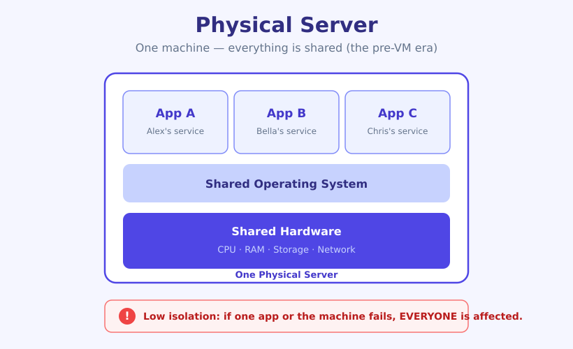
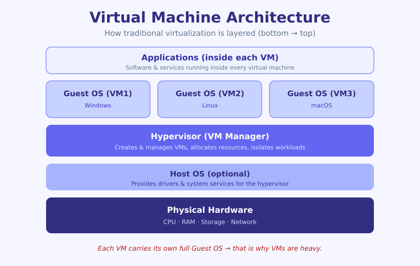
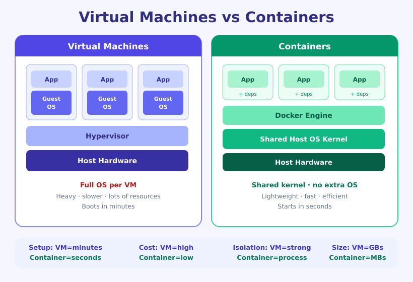
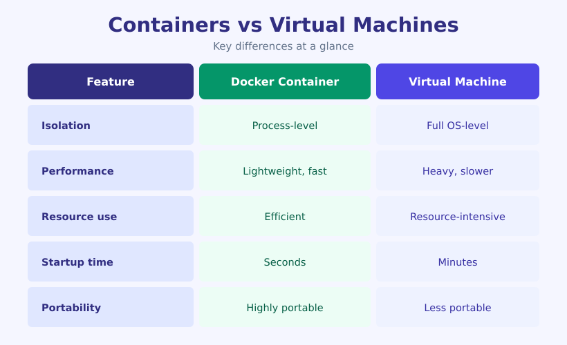
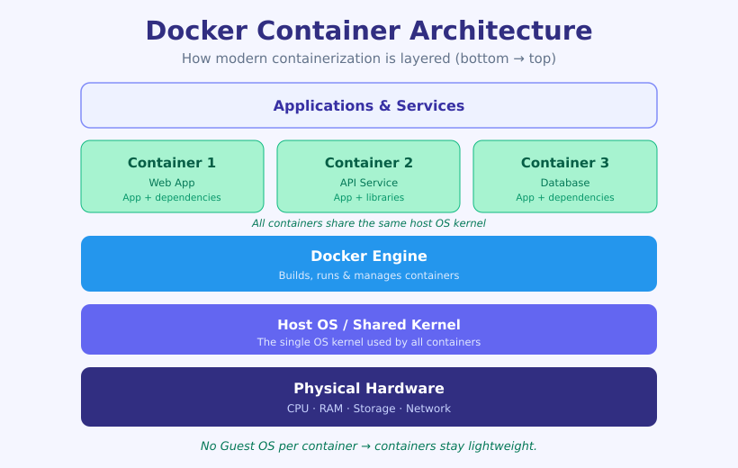
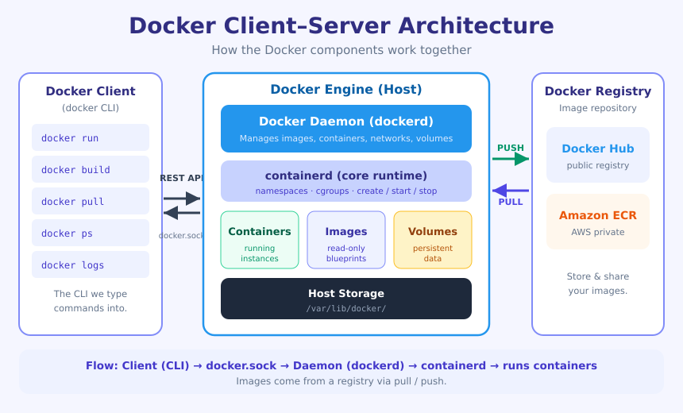
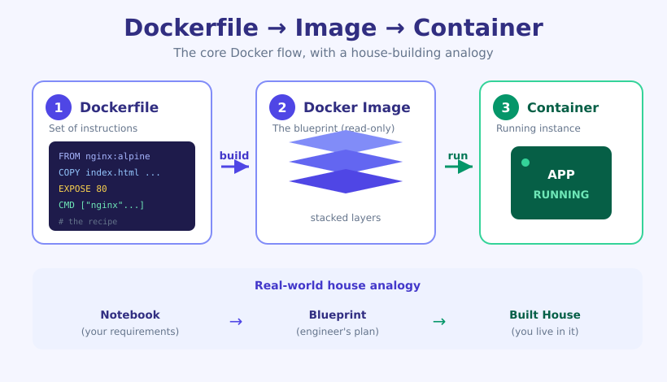

# 🐳 Docker — Class 1 (সম্পূর্ণ নোট)

> এই ক্লাসে আমরা VM থেকে Container পর্যন্ত পুরো যাত্রা, Docker এর architecture, এবং হাতে-কলমে একটা nginx app চালানো শিখেছি।

**এই ক্লাসের টপিকগুলো:**
Evolution of VMs → What is VM → Containers → Docker | ContainerD → Docker Architecture → Docker Recipe → Docker Postmortem → Run Docker Containers → Inspect Docker Container

---

## ১. Physical Server — VM এর আগের যুগ

Container বা VM আসার আগে সব application একটাই physical machine এর উপর একসাথে চলত।



একটা **যৌথ পরিবারের বাড়ির** সাথে তুলনা করলে বোঝা সহজ — সবাই এক ছাদের নিচে, একই hardware, একই OS, একই resource শেয়ার করে।

| দিক | Physical Server এ যা হতো |
|-----|--------------------------|
| Hardware | সবার জন্য একটাই (shared) |
| Operating System | একটাই OS সবাই শেয়ার করে |
| Isolation | খুবই কম — একজনের সমস্যা সবাইকে affect করে |
| Flexibility | কম (rigid), একটা machine এর উপর পুরো নির্ভরশীল |

✅ **মূল সমস্যা:** একটা app crash করলে বা একটা bug থাকলে **পুরো machine সহ বাকি সব app** সমস্যায় পড়ত। এখান থেকেই **isolation** এর দরকার তৈরি হয় — আর সেটাই VM ও Container এর জন্ম দেয়।

---

## ২. Virtual Machine (VM) কী?

> **📖 সংজ্ঞা — Virtual Machine (VM):** একটা physical computer এর ভেতরে software দিয়ে বানানো একটা "নকল/virtual কম্পিউটার", যার নিজের আলাদা full Operating System থাকে। একই hardware কে অনেক ভাগে ভাগ করে প্রতিটা ভাগকে একটা স্বতন্ত্র কম্পিউটারের মতো ব্যবহার করা যায়।
>
> **উদাহরণ ১:** একটা শক্তিশালী server এর উপর VMware/VirtualBox দিয়ে ৩টা VM বানানো — একটায় Windows, একটায় Linux, একটায় macOS।
> **উদাহরণ ২:** AWS এর EC2 instance আসলে cloud এ চলা একটা VM।

VM কে বলা যায় **আলাদা আলাদা বড় বাড়ি (Family Estate)** — প্রতিটা ভাই-বোনের জন্য সম্পূর্ণ আলাদা বাড়ি, নিজের ছাদ, নিজের plumbing, নিজের সব।

### VM Architecture (স্তরে স্তরে সাজানো)



নিচ থেকে উপরে স্তরগুলো:

| Layer | কাজ |
|-------|-----|
| **Physical Hardware** | CPU, RAM, Storage, Network — আসল যন্ত্রপাতি |
| **Host OS (Optional)** | Hypervisor এর জন্য driver ও system service দেয় |
| **Hypervisor (VM Manager)** | VM তৈরি করে, resource বণ্টন করে, VM গুলোকে আলাদা রাখে |
| **Guest OS (প্রতি VM এ আলাদা)** | প্রতিটা VM এর নিজস্ব full OS (Windows / Linux / macOS) |
| **Applications** | প্রতিটা VM এর ভেতরে চলা app ও service |

> **📖 সংজ্ঞা — Hypervisor:** যে software VM তৈরি ও পরিচালনা করে এবং hardware resource ভাগ করে দেয়।
> **উদাহরণ ১:** VMware ESXi (server এর জন্য)। **উদাহরণ ২:** Oracle VirtualBox (পার্সোনাল ল্যাপটপে)।

✅ **মনে রাখুন:** প্রতিটা VM এ **আলাদা full OS** থাকে বলেই VM ভারী (heavy), size বড়, এবং boot হতে সময় বেশি লাগে।

---

## ৩. Container কী?

> **📖 সংজ্ঞা — Container:** একটা lightweight, isolated প্যাকেজ যেখানে একটা application ও তার সব dependency (library, config) একসাথে বান্ডিল থাকে। VM এর মতো আলাদা OS নেয় না — **host machine এর OS kernel শেয়ার করে**, তাই অনেক হালকা ও দ্রুত।
>
> **উদাহরণ ১:** একটা Node.js API কে তার সব library সহ একটা container এ প্যাক করে যেকোনো machine এ হুবহু একইভাবে চালানো।
> **উদাহরণ ২:** একটা database (MySQL) container হিসেবে সেকেন্ডে চালু করে ফেলা।

Container কে বলা যায় **একটা apartment building** — এক building (এক OS kernel), ভেতরে অনেক আলাদা flat (container), প্রতিটা flat নিজের মতো isolated, কিন্তু ছাদ-ভিত্তি (kernel) শেয়ার করা।

### জনপ্রিয় Container Technology
- **Docker** — সবচেয়ে জনপ্রিয়, industry standard
- **Podman** — Docker এর daemonless বিকল্প
- **LXC** (Linux Containers) — লো-লেভেল Linux container
- **Kubernetes (K8s)** — অনেক container একসাথে চালানো ও manage করার orchestration tool

✅ Container **application-level** virtualization, VM **OS-level** virtualization।

---

## ৪. VM vs Container — মূল পার্থক্য

দুটো পদ্ধতির তুলনা একটা analogy দিয়ে:



**VM = বড় আলাদা বাড়ি** (ভারী, দামি, redundant) ↔ **Container = ছোট apartment** (হালকা, দ্রুত, efficient)।

মূল পার্থক্যগুলো এক টেবিলে:



| Feature | 🐳 Docker Container | 🖥️ Virtual Machine (VM) |
|---------|--------------------|--------------------------|
| **Isolation** | Process-level | Full OS-level |
| **Performance** | Lightweight, fast | Heavy, slower |
| **Resource Usage** | Efficient | Resource-intensive |
| **Startup Time** | Seconds ⚡ | Minutes ⏳ |
| **Portability** | Highly portable | Less portable |
| **আলাদা OS?** | না — host kernel শেয়ার করে | হ্যাঁ — প্রতি VM এ full OS |

✅ **এক লাইনে:** Container রা host OS এর kernel শেয়ার করে বলে **দ্রুত ও বেশি portable**; VM **শক্তিশালী isolation** দেয় কিন্তু **বেশি resource** খায়।

---

## ৫. Docker vs containerD

দুটো একই জিনিস নয় — একটা আরেকটার উপর কাজ করে:

| জিনিস | কী |
|-------|-----|
| **Docker** | সম্পূর্ণ platform/tool (build, ship, run — সব)। ব্যবহারকারী এর সাথে কাজ করে (`docker` CLI দিয়ে)। |
| **containerd** | Docker এর ভেতরে থাকা **core container runtime** — container তৈরি, চালু, বন্ধ, delete এর আসল কাজ এটাই করে। |

✅ সহজ করে: **Docker হলো পুরো গাড়ি**, **containerd হলো তার ইঞ্জিন**। Docker এর নিচে containerd কাজ করে।

---

## ৬. Docker Container Architecture



নিচ থেকে উপরে:

| Layer | কাজ |
|-------|-----|
| **Physical Hardware** | CPU, RAM, Storage, Network |
| **Host OS / Shared Kernel** | একটাই OS kernel, যা সব container শেয়ার করে |
| **Docker Engine** | container build, run ও manage করে |
| **Containers (1, 2, 3...)** | প্রতিটা container এ আলাদা app + dependency (যেমন: Web App, API, Database) |
| **Applications** | container এর ভেতরে চলা service |

✅ **VM Architecture এর সাথে পার্থক্য:** VM এ প্রতিটার আলাদা **Guest OS** ছিল; এখানে সব container **একটাই host kernel** শেয়ার করে — এজন্যই container হালকা।

---

## ৭. Docker Client–Server Architecture (কীভাবে কাজ করে)

Docker একটা **client–server** model এ চলে। CLI দিয়ে কমান্ড দিলে সেটা daemon এর কাছে যায়, daemon আসল কাজ করে।



### প্রধান component গুলো

| Component | কাজ |
|-----------|-----|
| **Docker Client (`docker` CLI)** | আমরা যে কমান্ড টাইপ করি (`docker run`, `docker build`...) — এটাই client |
| **Docker Daemon (`dockerd`)** | background service, যা image/container/network/volume সব manage করে |
| **containerd** | container এর পুরো lifecycle (create/start/stop/delete) সামলায় |
| **REST API / Socket** | Client ও Daemon এর মধ্যে যোগাযোগ হয় `/var/run/docker.sock` এর মাধ্যমে |
| **Docker Registry** | image রাখার জায়গা (Docker Hub, Amazon ECR) — এখান থেকে `pull`/`push` হয় |

### containerd এর ভেতরের কিছু গুরুত্বপূর্ণ টার্ম
- **Namespaces** → প্রতিটা container কে আলাদা "নিজের জগৎ" দেয় (isolation)। এক container অন্যটার process দেখতে পায় না।
- **Cgroups** (control groups) → প্রতি container কত CPU/RAM ব্যবহার করবে তার লিমিট ঠিক করে।
- **Images / Volumes** → blueprint (image) ও persistent data storage (volume)।

> **📖 সংজ্ঞা — Docker Registry:** Docker image সংরক্ষণ ও শেয়ার করার অনলাইন repository।
> **উদাহরণ ১:** Docker Hub (public, সবচেয়ে বড়)। **উদাহরণ ২:** Amazon ECR (AWS এর private registry)।

---

## ৮. Docker Image কোথায় থাকতে পারে?

একটা image ৩ জায়গায় থাকতে পারে:

| জায়গা | ব্যাখ্যা |
|--------|----------|
| **Local PC** | নিজের machine এ Dockerfile দিয়ে build করা image |
| **Docker Hub** | public/cloud registry — এখান থেকে pull করা যায়, নিজের image push-ও করা যায় |
| **Amazon ECR** | AWS এর private container registry |

✅ আমরা নিজের বানানো image **Docker Hub এ push করে দিতে পারি**, আবার অন্যের বানানো image **pull করে নিতে পারি**।

---

## ৯. Dockerfile → Image → Container (সবচেয়ে জরুরি ধারণা)



একটা বাড়ি বানানোর analogy দিয়ে বোঝা সবচেয়ে সহজ:

| ধাপ | বাড়ির analogy | Docker |
|-----|---------------|--------|
| ১ | আপনার notebook এ লেখা home requirement | **Dockerfile** (instruction এর সেট) |
| ২ | Civil engineer এর বানানো blueprint | **Docker Image** (blueprint) |
| ৩ | তৈরি হয়ে যাওয়া আসল বাড়ি | **Running Container** (image এর চলন্ত instance) |

✅ **মূল কথা:**
- **Dockerfile** = কী কী করতে হবে তার নির্দেশনা (text file)।
- **Image** = ওই নির্দেশনা থেকে build হওয়া read-only blueprint।
- **Container** = image চালু করলে যে জীবন্ত/running instance তৈরি হয়।

✅ **`docker run hello-world` দিলে কী হয়?** image থেকে সরাসরি একটা container বানিয়ে চালিয়ে দেয়। অর্থাৎ **image run করলেই container তৈরি হয়ে চালু হয়ে যায়।**

> **📖 সংজ্ঞা — Dockerfile:** ছোট ছোট instruction (FROM, COPY, RUN, CMD...) এর একটা text file, যা থেকে Docker image তৈরি হয়।
> **উদাহরণ ১:** `FROM node:20` দিয়ে Node.js এর একটা app image বানানো। **উদাহরণ ২:** `FROM nginx:alpine` দিয়ে একটা web server image বানানো।

---

## ১০. Ubuntu তে Docker Install করা

```bash
# Docker install করা
sudo apt install docker.io -y

# Docker service চালু করা
sudo systemctl start docker

# machine reboot হলেও Docker যাতে auto-start হয়
sudo systemctl enable docker

# ঠিকমতো install হয়েছে কিনা check
docker --version
```

✅ **ভালো-জানা (production tip):** `docker.io` হলো Ubuntu এর নিজস্ব repo এর package — শেখার জন্য একদম ঠিক আছে। তবে production/latest version এর জন্য **Docker এর official repo** (`docker-ce`) recommended।

---

## ১১. প্রথম কমান্ড ও Permission সমস্যা সমাধান

Install হয়ে গেলে প্রথমে সাধারণত এটা চালানো হয়:

```bash
docker ps
```

`docker ps` দিয়ে দেখা যায় কোনো container চলছে কিনা। কিন্তু প্রথমবার এটা **`permission denied`** দেখাতে পারে।

✅ **কেন এই error?** (সঠিক ব্যাখ্যা)
Docker daemon এর সাথে কথা বলা হয় **Docker socket** (`/var/run/docker.sock`) এর মাধ্যমে। এই socket এর access শুধু `docker` group এর user রা পায়। Install এর সময় একটা `docker` group তৈরি হয়, **কিন্তু ওই group এ কোনো user শুরুতে যোগ করা থাকে না** — তাই সাধারণ user permission পায় না।

> **📖 সংজ্ঞা — Docker socket:** `dockerd` (daemon) যে Unix socket এ শোনে, client তার মাধ্যমেই daemon কে কমান্ড পাঠায়। ঠিকানা: `/var/run/docker.sock`।

Linux এ কোনো কিছু install করলে সাধারণত একটা group তৈরি হয়। group গুলো দেখতে:

```bash
cat /etc/group
```

### সমাধান: বর্তমান user কে `docker` group এ যোগ করা

```bash
# ubuntu (বর্তমান) user কে docker group এ যোগ করা
sudo usermod -aG docker $USER

# group এ user যোগ হয়েছে কিনা check
cat /etc/group

# Docker service ঠিকঠাক চলছে কিনা check
sudo systemctl status docker
```

এরপরও `docker ps` দিলে **এখনো permission denied দেখাতে পারে**, কারণ group পরিবর্তন current session এ এখনো apply হয়নি।

✅ **সমাধানের সহজ উপায় — session নতুন করে নেওয়া:**

```bash
# সবচেয়ে সহজ (কিন্তু ভারী) উপায়:
sudo reboot
```

✅ **অতিরিক্ত টিপ (reboot ছাড়াও করা যায়):** পুরো machine reboot না করে শুধু নতুন group session নিতে পারেন —

```bash
newgrp docker        # অথবা: logout করে আবার login
```

Reboot/relogin এর পর আবার:

```bash
docker ps
```

এবার Docker এর তথ্য দেখালে বুঝবেন সব ঠিকমতো কাজ করছে। ✅

### Test: hello-world চালানো

```bash
docker run hello-world
```

Docker এর একটা ছোট test image হলো `hello-world`। এটা চালালে Docker ঠিকঠাক install ও কাজ করছে কিনা যাচাই হয়ে যায়।

---

## ১২. `docker ps` বনাম `docker ps -a`

```bash
docker ps       # শুধু বর্তমানে চালু (running) container দেখায়
docker ps -a    # সব container দেখায় — চালু + বন্ধ (stopped/exited) উভয়ই
```

✅ `hello-world` চালানোর পর `docker ps -a` দিলে ওই process/container দেখতে পাবেন — যদিও কাজ শেষ করে সেটা **exited** অবস্থায় চলে গেছে। কিছু container up-and-running থাকে, কিছু কাজ শেষে stop হয়ে যায়; **stopped গুলো দেখতে `docker ps -a` লাগে।**

---

## ১৩. 🛠️ হাতে-কলমে: nginx দিয়ে custom App চালানো (Docker Recipe)

**উদ্দেশ্য:** nginx container চলবে, কিন্তু nginx এর default page না দেখিয়ে **আমাদের নিজের `index.html`** দেখাবে।

### ধাপ ১ — folder ও ফাইল তৈরি

```bash
mkdir nginx-demo
cd nginx-demo

# নিজের HTML content লেখা
vim index.html
```

### ধাপ ২ — একই folder এ Dockerfile তৈরি

```bash
vim Dockerfile
```

**Dockerfile এর ভেতরে:**

```dockerfile
FROM nginx:alpine
COPY index.html /usr/share/nginx/html/index.html
EXPOSE 80
CMD ["nginx", "-g", "daemon off;"]
```

প্রতিটা লাইনের মানে:

| লাইন | কাজ |
|------|-----|
| `FROM nginx:alpine` | base image হিসেবে হালকা `alpine` ভিত্তিক nginx নেওয়া |
| `COPY index.html ...` | আমাদের HTML কে nginx এর default html ফোল্ডারে বসানো |
| `EXPOSE 80` | container টি ৮০ নম্বর port ব্যবহার করে — এটা মূলত **documentation** |
| `CMD ["nginx","-g","daemon off;"]` | container চালু হলে nginx কে **foreground এ** চালানো |

✅ **`daemon off;` কেন জরুরি?** nginx সাধারণত background এ (daemon হিসেবে) চলে চলে যায়, তখন container এর প্রধান process শেষ ভেবে **container সাথে সাথে exit করে ফেলে**। `daemon off;` দিলে nginx foreground এ চলে, ফলে container চালু থাকে।

✅ **`EXPOSE` বনাম `-p` (গুরুত্বপূর্ণ):** `EXPOSE` শুধু documentation — এটা একা port খোলে না। বাইরে থেকে access করতে হলে run করার সময় `-p host:container` দিয়ে **publish** করতে হয়।

### ধাপ ৩ — image build করা

```bash
docker build -t my-nginx-app:v1 .
```
- `-t my-nginx-app:v1` → image এর নাম:tag।
- শেষের `.` → বর্তমান folder এর Dockerfile ব্যবহার করো।

### ধাপ ৪ — image দেখা

```bash
docker images
```

### ধাপ ৫ — container run করা

```bash
docker run -d --name my-nginx-app-container -p 8080:80 my-nginx-app:v1
```

| অংশ | মানে |
|-----|------|
| `-d` | detached mode — background এ চালাও |
| `--name ...` | container এর একটা নাম দাও |
| `-p 8080:80` | **host port 8080** কে **container port 80** এর সাথে map করো |

✅ **Port mapping নিয়ম:** `-p host:container`
- **ডান পাশের port (80)** পরিবর্তন করা যাবে না — এটা container এর ভেতরের nginx এর default port।
- **বাম পাশের port (8080)** যেকোনো ফাঁকা (free) port হতে পারে — এটা host port।
- ✅ **Industry standard:** host ও container port একই রাখা (যেমন `80:80`)।

---

## ১৪. 🔍 Debugging (Docker Postmortem)

Container চালু আছে কিনা দেখা:

```bash
docker ps -a
```

যদি container **exited** দেখায় (মানে চালু হয়ে থেমে গেছে), তাহলে কারণ খুঁজতে log দেখতে হবে:

```bash
docker logs my-nginx-app-container
```

✅ ধরুন Dockerfile এ ভুল ছিল (যেমন `daemon off;` বাদ পড়া বা path ভুল)। ঠিক করার ধাপ:

```bash
# ১. চলমান/থেমে থাকা container জোর করে remove করা
docker rm -f my-nginx-app-container

# ২. পুরনো (ভুল) image remove করা
docker rmi my-nginx-app:v1
```

তারপর Dockerfile ঠিক করে **আবার build করে, আবার detached mode এ run** করতে হবে (ধাপ ৩ ও ৫ পুনরায়)।

✅ **AWS এ চালাতে চাইলে:** EC2 এর **Security Group** থেকে ব্যবহৃত port (যেমন 8080) **inbound rule এ enable** করতে হবে, নইলে browser থেকে access পাওয়া যাবে না।

---

## ১৫. 📋 প্রয়োজনীয় Docker কমান্ড (Cheat Sheet)

| কমান্ড | কাজ |
|--------|-----|
| `docker --version` | Docker version দেখা |
| `docker run hello-world` | test image চালিয়ে Docker যাচাই |
| `docker ps` | চালু container দেখা |
| `docker ps -a` | সব (চালু + বন্ধ) container দেখা |
| `docker images` | local image গুলোর তালিকা |
| `docker build -t name:tag .` | Dockerfile থেকে image build |
| `docker run -d --name x -p 8080:80 img` | container detached mode এ চালানো |
| `docker logs <container>` | container এর log দেখা (debug) |
| `docker rm -f <container>` | container জোর করে remove |
| `docker rmi <image>` | image remove |
| `docker pull <image>` | registry থেকে image নামানো |
| `docker push <image>` | registry তে image তোলা |

---

## ⭐ এক নজরে মূল পয়েন্ট

- ✅ **Physical Server → VM → Container** — এই বিবর্তনের মূল কারণ ছিল **isolation** ও **resource efficiency**।
- ✅ **VM** এ প্রতিটার আলাদা **full OS** থাকে → ভারী, ধীর, বেশি resource; **Hypervisor** VM manage করে।
- ✅ **Container** host এর **OS kernel শেয়ার** করে → হালকা, দ্রুত (seconds), highly portable।
- ✅ **Docker** = পুরো platform; **containerd** = তার ভেতরের core runtime (ইঞ্জিন)।
- ✅ Docker চলে **client–server** model এ: **Client (CLI) → Docker socket → Daemon (dockerd) → containerd**।
- ✅ মূল প্রবাহ: **Dockerfile → (build) → Image → (run) → Container**। image run করলেই container তৈরি হয়ে চালু হয়।
- ✅ Image থাকতে পারে **Local / Docker Hub / Amazon ECR** এ; `pull` করে আনা যায়, `push` করে তোলা যায়।
- ✅ প্রথম permission denied সমস্যা = user `docker` group এ নেই → `usermod -aG docker $USER` + **reboot/`newgrp docker`/relogin**।
- ✅ `docker ps` = শুধু চালু, `docker ps -a` = চালু + বন্ধ সব container।
- ✅ Port mapping `-p host:container` — ডান পাশ (container port) fixed, বাম পাশ (host port) free যেকোনোটা।
- ✅ `EXPOSE` শুধু documentation; আসল access এর জন্য `-p` লাগে।
- ✅ nginx এর `daemon off;` না দিলে container exit করে ফেলে; সমস্যা হলে **`docker logs`** দিয়ে postmortem।
- ✅ AWS এ চালালে **Security Group** এ port enable করতে ভুলবেন না।