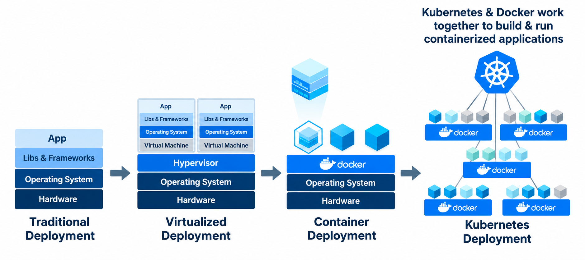
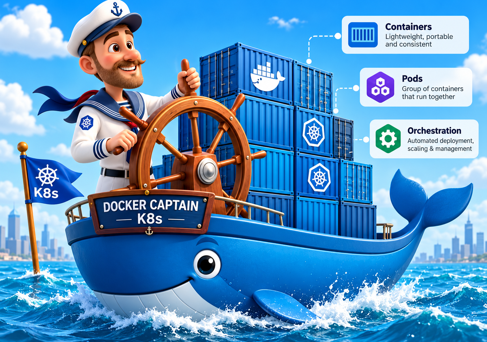
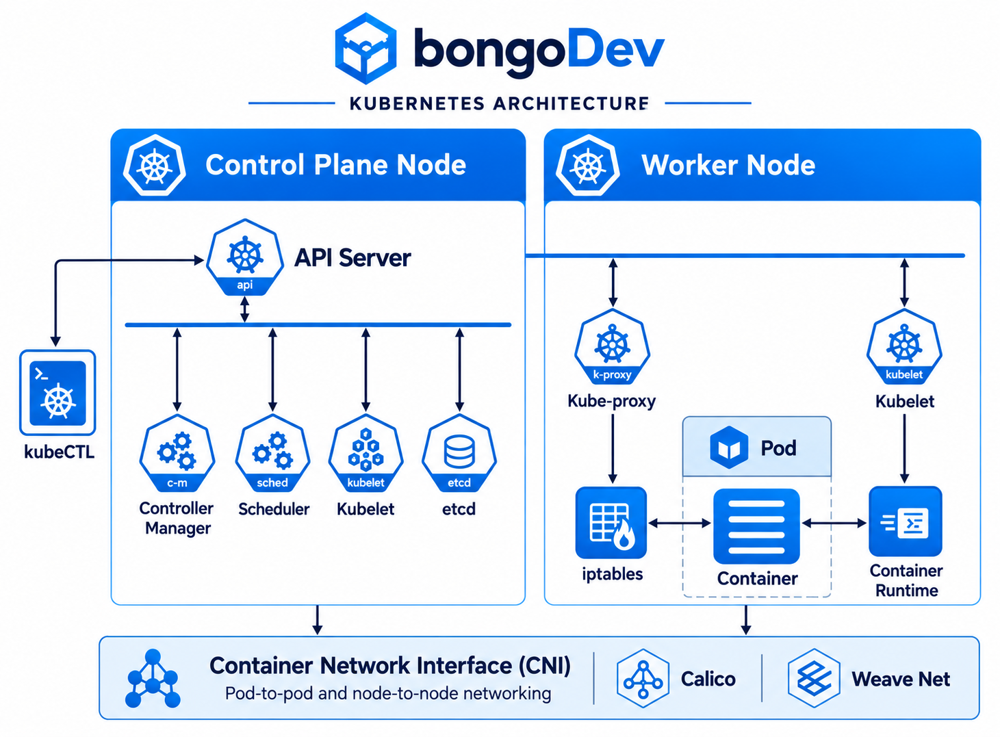

# Kubernetes (k8s) — Class 1 নোট

## ১. Kubernetes কী?

✅ **Kubernetes** একটি open source **container orchestration** tool — যা application container-এর **deployment, scaling ও management** automate করে।

- নাম **k8s** কারণ: `k` আর `s`-এর মাঝে ৮টি অক্ষর (k-**ubernete**-s)।
- সহজ কথায়: এক machine-এ অনেক container থাকলে সেগুলো manage করার জন্য একজন **manager** দরকার — k8s সেই manager।
- কোনো container-এর health খারাপ হলে k8s নিজেই সেটা সরিয়ে একই রকম নতুন container চালু করে।

> **Orchestration** = অনেকগুলো container-কে একসাথে automatic ভাবে চালানো, বাড়ানো-কমানো ও ঠিক রাখা।
> *উদাহরণ:* traffic বাড়লে নিজে নিজে ২টা থেকে ৫টা container চালু করা।

## ২. ইতিহাস — কেন k8s এলো?

Google-এর সমস্যাগুলো ছিল:

| সমস্যা | কী হতো |
|---|---|
| Manual healing | container দুর্বল হলে হাতে remove করে আবার add করতে হতো |
| Scaling | Black Friday / offer-এ হঠাৎ traffic বাড়লে machine overheat হয়ে crash করত |
| Patch / update | হাজার হাজার machine-এ Node v18 → v20 patch করা প্রায় অসম্ভব |

সমাধানের ধাপ:

| সাল | System |
|---|---|
| 2003–04 | **Borg** (Google internal) |
| 2013 | **Omega** |
| 2014 | ✅ **Kubernetes** — open source করা হয় |
| 2015 | ✅ Google k8s-কে **CNCF**-এ donate করে |

> **CNCF (Cloud Native Computing Foundation):** যে organization k8s-সহ cloud-native project-গুলো maintain করে এবং কোন software stable/production-ready তা certify করে (CNCF landscape)। *উদাহরণ:* Kubernetes, Prometheus, Helm — সবই CNCF project।

## ৩. Deployment-এর বিবর্তন



| ধাপ | বৈশিষ্ট্য |
|---|---|
| Traditional | এক hardware-এ সরাসরি app; resource নষ্ট হয় |
| Virtualized | Hypervisor দিয়ে অনেক VM; প্রতিটার আলাদা OS — ভারী |
| Container | এক OS share করে; হালকা, portable, consistent |
| ✅ Kubernetes | অনেক Docker container-কে একসাথে orchestrate করে |

## ৪. Docker vs Kubernetes



Docker-এর ধারণা এসেছে ship-এর container থেকে — **lightweight, portable, consistent**।

| Feature | Docker | Kubernetes |
|---|---|---|
| Container build/run | ✅ | (Docker image ব্যবহার করে) |
| Auto scaling | ✕ | ✅ |
| Auto healing | ✕ | ✅ |
| Load balancing | ✕ | ✅ |
| Replica (min-2, max-5) | ✕ | ✅ |

✅ **Docker ও k8s প্রতিদ্বন্দ্বী নয়** — Docker container বানায়, k8s সেগুলো চালায় ও manage করে।

**কোনটা কখন?**

| পরিস্থিতি | Tool |
|---|---|
| Microservices, বড় traffic, auto scaling দরকার | k8s |
| Monolithic / ছোট project, কম budget | Docker |

> Class-এ বলা হয়েছে: k8s cluster চালাতে মোটামুটি **$400/মাস**-এর মতো bill আসতে পারে — expensive কিন্তু খুব efficient। এর চেয়ে ছোট কাজে Docker যথেষ্ট।

## ৫. Kubernetes Architecture



```
Cluster
 └── Nodes (machine/server)
      ├── Control Plane (master)  → brain: config, controller, decision
      └── Worker Node(s)          → এখানে app (pod) চলে
```

> **Cluster:** এক বা একাধিক node (machine)-এর group। *উদাহরণ:* ১টা master + ২টা worker = ৩ node-এর cluster।
> **Pod:** k8s-এর সবচেয়ে ছোট unit; ভেতরে এক বা একাধিক container থাকে। ✅ Standard: **এক pod = এক container**। *উদাহরণ:* frontend-এর জন্য এক pod, backend-এর জন্য আরেক pod, DB-র জন্য আরেক pod।

### Control Plane-এর component

| Component | কাজ |
|---|---|
| ✅ **API Server** | cluster-এর প্রবেশদ্বার। `kubectl` ও সব component এর মাধ্যমেই কথা বলে; etcd-তে entry করে |
| **etcd** | k8s-এর database (key-value store)। pod-এর state, config সব এখানে। ✅ এর **backup নিতেই হবে** |
| **Controller Manager** | সারাক্ষণ **desired state vs actual state** মেলায়। pod মরে গেলে নতুন pod বানানোর instruction দেয়; ✅ replica অনুযায়ী pod সংখ্যা ঠিক রাখে |
| **Scheduler** | ✅ নতুন pod **কোন worker node-এ** চলবে সেটা ঠিক করে (node-এর resource দেখে) |

### Worker Node-এর component

| Component | কাজ |
|---|---|
| ✅ **kubelet** | প্রতিটি worker node-এর agent। API Server থেকে instruction নেয়, pod up & running রাখে, node-এর status control plane-কে জানায় |
| **kube-proxy** | node-এর networking/iptables manage করে; pod-এ traffic পৌঁছায় |
| **Container Runtime** | আসলে container চালায় (Docker / containerd) |
| **CNI (Calico, Weave Net)** | pod-to-pod ও node-to-node networking |

### একটি pod তৈরির flow

```
kubectl → API Server → etcd (entry)
        → Scheduler (কোন node?) → API Server
        → kubelet (সেই node-এ) → Container Runtime → Pod চালু
        → kubelet status জানায় → API Server → etcd update
Controller Manager সারাক্ষণ etcd-র state দেখে monitor করে
```

✅ সব component **শুধু API Server-এর মাধ্যমে** কথা বলে — সরাসরি একে অপরের সাথে নয়।

## ৬. Auto scaling কীভাবে হয়?

- Replica set করা হয়: `min: 2, max: 5`
- Traffic বাড়লে → pod বাড়ে (Controller/HPA), Scheduler ঠিক করে নতুন pod কোন node-এ যাবে
- Traffic কমলে → আবার minimum-এ ফিরে আসে

## ৭. kubectl — Docker-এর সাথে তুলনা

| Docker | Kubernetes |
|---|---|
| `docker ps` | `kubectl get pods` |
| `docker run` | `kubectl apply -f pod.yaml` |

Pod-এর container আসে **Docker image** থেকে — Docker Hub / AWS ECR।

## ৮. Installation

k8s আসলে অনেকগুলো software-এর collection (API server, controller manager, scheduler, etcd, kubelet, CNI…)। তাই একসাথে install করার জন্য tool লাগে:

| Tool | ব্যবহার |
|---|---|
| ✅ **minikube** | local/learning — পুরো cluster একটা container/VM-এ চলে |
| **kind** | Docker container-এর ভেতরে k8s (testing) |
| **kubeadm** | নিজে production cluster বানাতে |
| **EKS / GKE / AKS** | AWS / Google / Azure-এর managed k8s — control plane cloud নিজে চালায় |

Guide: https://github.com/bongodev/k8sStarter/

```bash
# minikube install করার পর
minikube status

# cluster-এর node দেখা
kubectl get nodes

# pod দেখা
kubectl get pods
```

## এক নজরে মূল পয়েন্ট

- ✅ k8s = open source container orchestration tool (deployment, scaling, management automate করে)
- ✅ Google-এর Borg → Omega → Kubernetes (2014) → CNCF
- ✅ Docker container বানায়; k8s container চালায় ও manage করে — দুটো একসাথে কাজ করে
- ✅ k8s দেয়: auto healing, auto scaling, load balancing, rolling update
- ✅ Cluster = Control Plane + Worker Nodes; Pod = সবচেয়ে ছোট unit (1 pod = 1 container standard)
- ✅ Control Plane: API Server (গেট), etcd (DB), Controller Manager (desired state), Scheduler (কোন node)
- ✅ Worker Node: kubelet (agent), kube-proxy (network), Container Runtime
- ✅ সব communication API Server দিয়ে; etcd-র backup জরুরি
- ✅ Microservices → k8s; Monolithic/ছোট project → Docker
- ✅ Local: minikube; Cloud: EKS / GKE / AKS